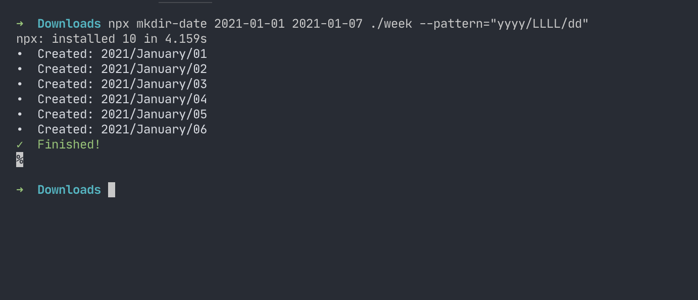
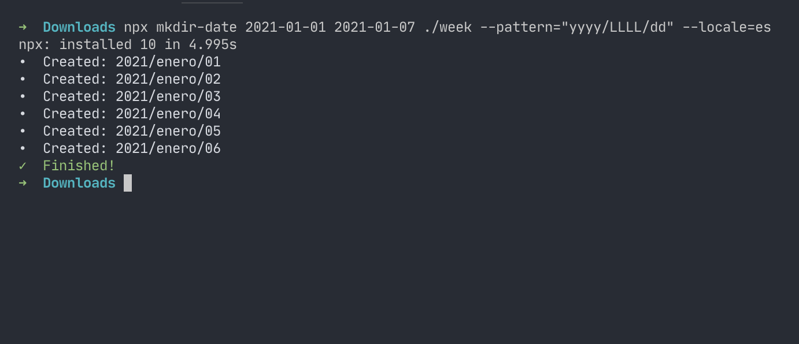

<br><br><br>
<center>
<h1>mkdir-date</h1>
<p>A tool to create directories for each days in a period of time.</p>
</center>
<br><br><br>

## Installation
```shell
npm i mkdir-date
```

## Usage
```
npx mkdir-date --help
```
```
Usage:
  mkdir-date [from] [to] [target]

Example: create a directory for each day for a year quarter
  mkdir-date 2020-01-01 2020-03-31 ./period/q1

Arguments:
  from         The start of the date period in ISO format (YYYY-MM-DD).
  to           The end of the date period in ISO format (YYYY-MM-DD).
  target       The target directory where directories will be created.

Options:
  --skip-day   Indicates a day in a week to skip. Starting on Sunday as 0 and Saturday as 6.
               It can be used more than once.
               Example: skip weekend
                 --skip-day=0 --skip-day=6
  --pattern    The pattern to use when creating directories.
               Default: yyyy/LL/dd
               See https://date-fns.org/v2.16.1/docs/format for more information.
  --locale     The local to use when applying the pattern when creating directories
               Default: enUS
               See https://date-fns.org/v2.16.1/docs/I18n for more information.
```
### Arguments

#### `from`
The start of the date period in ISO format (YYYY-MM-DD).

#### `to`
The end of the date period in ISO format (YYYY-MM-DD).

#### `target`
The target directory where directories will be created.

**Note:** If the target doesn't exist then it will be created.

### Options

#### `--skip-day`
Indicates a day in a week to skip. Starting on Sunday as 0 and Saturday as 6. It can be used more than once.

Example to skip weekend days: `--skip-day=0 --skip-day=6` or `--skip-day=0,6`

#### `--pattern`
The pattern to use when creating directories. [View more information on tokens](https://date-fns.org/v2.16.1/docs/format).

**Default:** `yyyy/LL/dd`.

#### `--locale`
The local to use when applying the pattern when creating directories. [View more information on locales](https://date-fns.org/v2.16.1/docs/I18n).

**Default:** `enUS`.

## Examples

### Create directories for each weekend days in a month
```shell
npx mkdir-date 2021-01-01 2021-01-31 ./january-weekends --skip-day=1,2,3,4,5
```

**Output:**


### Create directories using a different pattern
```shell
npx mkdir-date 2021-01-01 2021-01-07 ./week --pattern="yyyy/LLLL/dd"
```

**Output:**


### Create directories using a different locale
```shell
npx mkdir-date 2021-01-01 2021-01-07 ./week --pattern="yyyy/LLLL/dd" --locale=es
```

**Output:**


## Development

 1. Clone this repository.
 2. Install dependencies: `npm i`.
 3. Run it locally: `npm start` or `./src/bin.js`

### Tests
<small>Halp! We still don't have them...</small>

### Releases
Releases are triggered by `npm version` and handled by [GitHub Actions](https://github.com/rmariuzzo/mkdir-date/actions?query=workflow%3Apublish).

<center><br><br><br>
Made with ♥ by [@rmariuzzo](https://github.com/rmariuzzo)
</center>