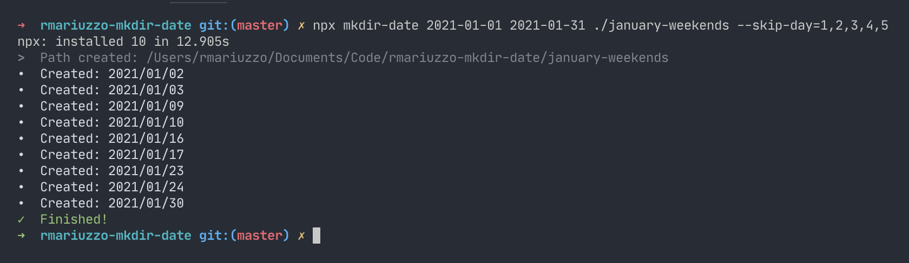

# mkdir-date
A tool to create directories for each days in a period of time.



## Usage

```shell
npx mkdir-date 2021-01-01 2021-01-31 ./january-weekends --skip-day=1,2,3,4,5
```

This will create a directory for each day in weekends of January 2020.

## Installation
```shell
npx mkdir-date
```
or
```shell
npm i mkdir-date
```

## Documentation

```shell
npx mkdir-date --help
```

#### License
[Read the License](./LICENSE)